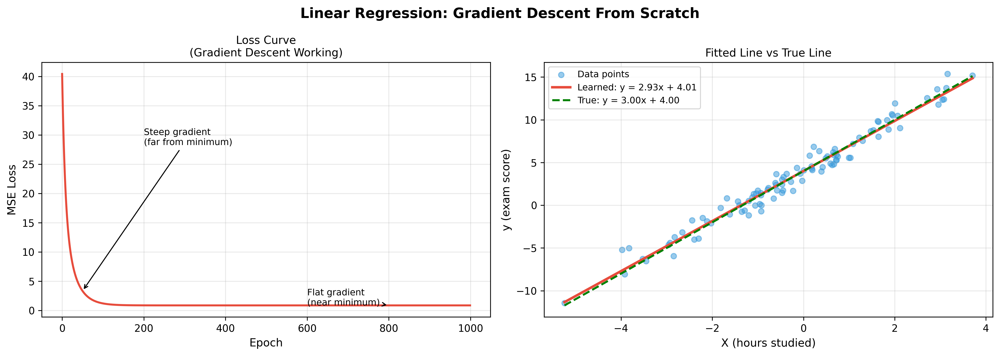
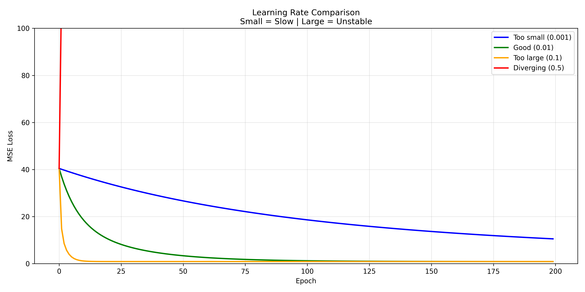
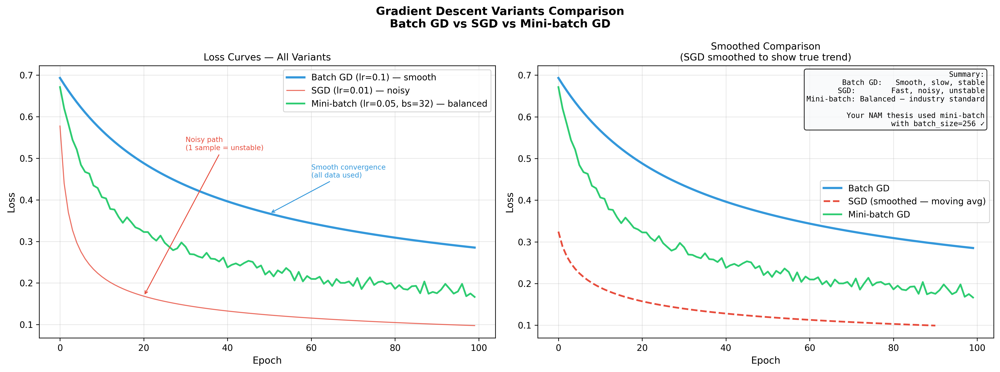
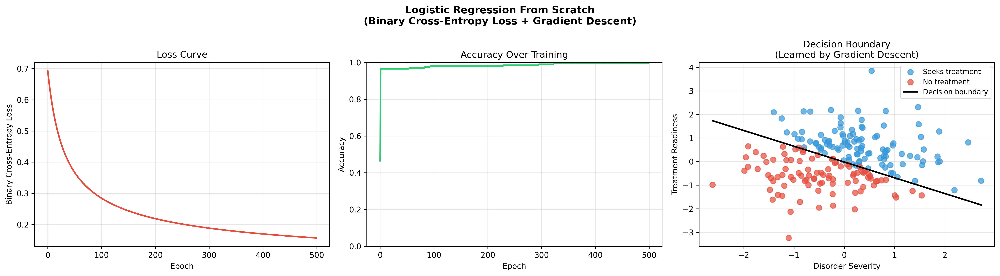

# gradient-descent-from-scratch
Rebuilding core machine learning algorithms using only NumPy — no scikit-learn, no PyTorch. Just math, code, and first principles.

🎯 Gradient Descent From Scratch

 <b>Rebuilding Machine Learning from First Principles</b>  <i>No black boxes. No shortcuts. Just math + code.</i> 
 
     

🚀 Project Overview

🎯 What This Project Does

This project answers one simple but powerful question:

❓ What actually happens when we train a machine learning model?

Instead of using libraries like scikit-learn or PyTorch, everything is implemented manually using:

NumPy
Matplotlib
⚙️ Implemented From Scratch
✅ Linear Regression
✅ Logistic Regression
✅ Gradient Descent:
Batch GD
Stochastic GD (SGD)
Mini-batch GD

❌ What’s NOT Used
No scikit-learn
No TensorFlow
No PyTorch

Just math + code + understanding

🎥 Gradient Descent in Action

  
 
 <i>Gradient descent optimizing loss step-by-step</i> 

🧠 Core Idea

Gradient Descent = iteratively minimizing error

Start with random weights
        ↓
Make predictions
        ↓
Compute loss
        ↓
Compute gradients
        ↓
Update weights
        ↓
Repeat until convergence
📐 Mathematical Foundation
Linear Regression
ŷ = wx + b

Loss (MSE):
L = (1/n) Σ(y - ŷ)²

Gradients:
∂L/∂w = -(2/n) Σ x(y - ŷ)
∂L/∂b = -(2/n) Σ (y - ŷ)
Logistic Regression
σ(z) = 1 / (1 + e^-z)

Loss:
Binary Cross Entropy

Gradients:
∂L/∂w = (1/n) Xᵀ(y_pred - y)
∂L/∂b = mean(y_pred - y)

📊 Results & Visualizations
📉 1. Linear Regression (Gradient Descent Working)

  

🔍 What this shows:
Left plot (Loss Curve)
Rapid drop at start → steep gradient
Slowly flattening → convergence
Right plot (Model Fit)
Learned line ≈ True line
Model successfully recovers:
w ≈ 3
b ≈ 4

⚡ 2. Learning Rate Comparison

  

🔍 Key Insight:
Learning Rate	Behavior
0.001	🐢 Too slow
0.01	✅ Optimal
0.1	⚠️ Risky
0.5	❌ Diverges

👉 Takeaway:
Choosing the right learning rate is critical for convergence.

🔄 3. Gradient Descent Variants

  

🔍 Comparison:
Method	             Behavior
Batch GD	Smooth, stable, slow
SGD	        Fast, noisy, unstable
Mini-batch	 ⚖️ Best balance

👉 Real-world insight:
Mini-batch GD is the industry standard.

📈 4. Logistic Regression (Classification)

  

🔍 What this shows:
Loss Curve → steadily decreasing
Accuracy → quickly reaches ~100%
Decision Boundary → clearly separates classes

👉 The model learns a linear boundary using gradient descent.

💡 Key Learnings
Gradient Descent is just iterative optimization
Learning rate controls speed vs stability
SGD introduces noise
Mini-batch = best practical choice
Models are just math — nothing magical

🛠️ How to Run
git clone https://github.com/JIYA-YDV/gradient-descent-from-scratch.git
cd gradient-descent-from-scratch

python 1_linear_regression.py
python learning_rate_comparison.py
python 3_comparison.py
python logistic_regression.py
